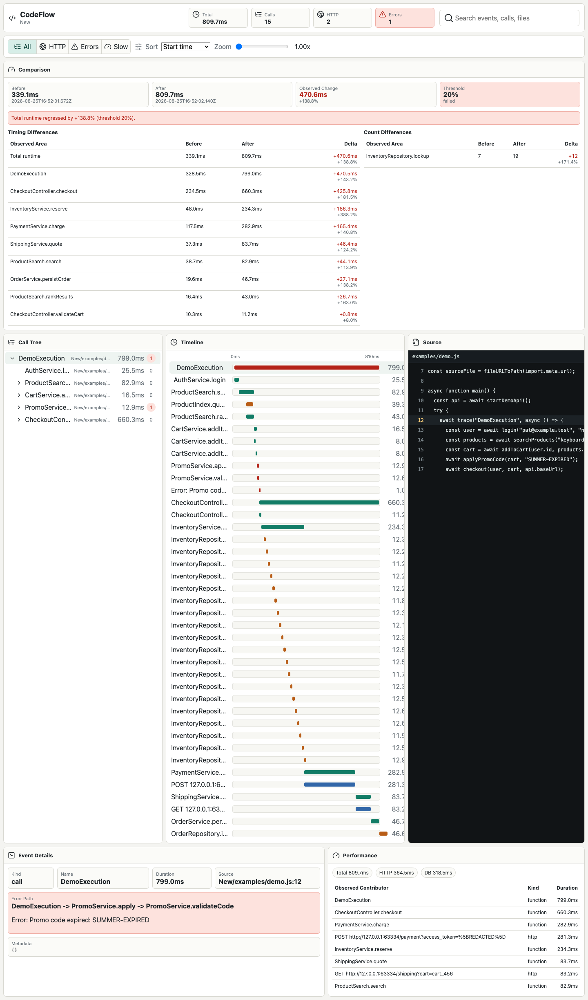
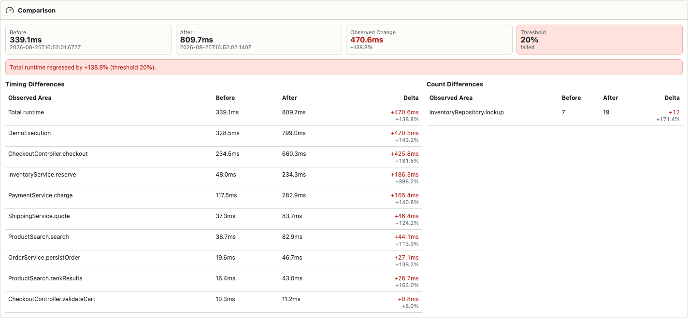

# CodeFlow

**Understand what your code actually did.**

CodeFlow is a local-first developer tool that records real Node.js execution and turns it into an interactive, explorable execution story.

Record a real run, inspect its timeline and call tree, jump back to source, and compare sessions to spot observed performance regressions.



## What You Can Do

- Record Node.js commands without sending execution data to a hosted service.
- Trace explicit function spans and stable runtime surfaces, including HTTP, console, files, errors, Express, and Fastify routes.
- Explore synchronized timeline, call tree, source, HTTP, error, and performance views in a local browser viewer.
- Compare two sessions, identify changed durations and call counts, and fail CI when a configured regression threshold is exceeded.
- Export portable, versioned session JSON plus Markdown and HTML reports.

## Requirements

- Node.js 22 or later
- npm 11 or later

## Quick Start

```bash
npm install
npm run build
npm test
npm run test:e2e
codeflow init
codeflow record --output .codeflow/demo-session.json -- node examples/demo.js
codeflow open .codeflow/demo-session.json
```

Refresh the checked-in viewer screenshots with `npm run docs:capture-assets`.

## Example Session

```json
{
  "version": 1,
  "metadata": {
    "project": "example",
    "runtime": "node",
    "runtimeVersion": "v24.11.1",
    "timestamp": "2026-08-25T00:00:00.000Z"
  },
  "events": [],
  "calls": [],
  "http": [],
  "errors": [],
  "files": []
}
```

## Timeline



The viewer synchronizes the timeline, call tree, source panel, event metadata, HTTP activity, errors, performance summary, and optional before/after comparison from recorded session JSON.

## Comparison Example

```bash
codeflow record --output .codeflow/before.json -- node examples/demo.js
CODEFLOW_DEMO_REGRESSION=1 codeflow record --output .codeflow/after.json -- node examples/demo.js
codeflow compare .codeflow/before.json .codeflow/after.json --threshold 20
```

Example output:

```text
Before: 355.6ms
After: 815.2ms
Observed change: 459.6ms (+129.2%)

Observed count differences:
  InventoryRepository.lookup: 7 -> 19 (+12)

Regression detected:
  Total runtime regressed by +129.2% (threshold 20%).
```

## Architecture

```mermaid
flowchart LR
  CLI[codeflow CLI] --> Recorder[@codeflow/recorder]
  Recorder --> Core[@codeflow/core trace API]
  Recorder --> Session[Portable session JSON]
  Session --> Analyzer[@codeflow/analyzer]
  Analyzer --> Viewer[Local viewer]
  Analyzer --> Exporters[Reports]
```

See [docs/architecture.md](docs/architecture.md).

## CLI Reference

- `codeflow init`
- `codeflow record [--capture-bodies] [--max-body-bytes 4096] -- <command>`
- `codeflow open <session.json>`
- `codeflow open <after.json> --compare <before.json> --threshold 20`
- `codeflow inspect <session.json>`
- `codeflow compare <before.json> <after.json>`
- `codeflow report <session.json> --format json|markdown|html`
- `codeflow validate <session.json>`
- `codeflow record-browser <url> [--timeout-ms 30000] [--settle-ms 500]`

See [docs/cli.md](docs/cli.md).

## Privacy Model

CodeFlow records locally and does not upload sessions. It does not capture passwords, cookies, authorization headers, request bodies, or response bodies by default. Fetch body previews are available only with explicit opt-in and are bounded and redacted. Obvious secrets in URLs, headers, metadata, and opt-in body previews are redacted.

See [docs/privacy.md](docs/privacy.md).

## Limitations

- Initial support is Node.js and TypeScript-oriented JavaScript.
- Function-level tracing is reliable when code uses `trace()`.
- Express and Fastify route handlers are auto-instrumented when those modules load after the recorder preload.
- Automatic instrumentation focuses on stable runtime surfaces, not instruction-level tracing.
- TypeScript source maps are resolved for generated JavaScript with inline or external source maps; complex bundler output may need more mapper work.
- Browser recording requires optional Playwright installation.

## Roadmap

- More automatic framework instrumentation.
- Chrome trace and OpenTelemetry exporters.
- Deeper source-map migration support.
- CI performance baselines.
- Python, Go, and Java integrations.
- Larger-session viewer virtualization.

## Contributing

Issues and pull requests are welcome. Start with [CONTRIBUTING.md](CONTRIBUTING.md), follow the [Code of Conduct](CODE_OF_CONDUCT.md), and read [SECURITY.md](SECURITY.md) before reporting vulnerabilities.

## License

[MIT](LICENSE)
